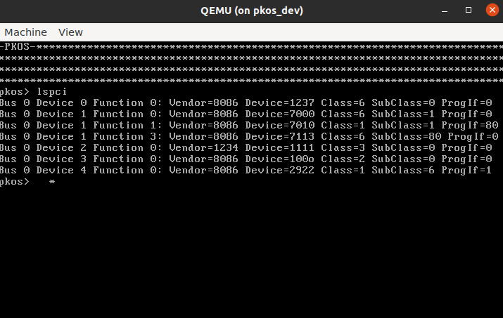
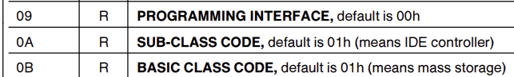

[Also available in English](./)

Todo nuestro mundo funciona con computadoras, pero pocos entienden cómo funcionan las computadoras a nivel más básico. Todo, desde tu teléfono y tu computadora portátil hasta los controladores de vuelo en un avión, contiene al menos un chip llamado CPU, que le indica qué hacer.

import BlogYoutubeVideo from '~/components/common/BlogYoutubeVideo.astro';

<BlogYoutubeVideo videoId="HvZy19u1HDc" />

Se supone que el sistema operativo debe encargarse de todas las operaciones a nivel bajo, incluyendo la interfaz con hardware. Pero ¿cómo se ve esa interfaz en realidad? Es bastante sencillo escribir un archivo utilizando `file.write()` en Python, pero esto solo es una abstracción de lo que realmente ocurre. En algún lugar, bajo capas y capas de abstracción, hay un disco metálico girando o una unidad de estado sólido, y estás reorganizando ceros y unos en ese disco.

En esta serie, desechamos todas esas abstracciones cómodas que nos son proporcionadas y realizamos programación a nivel de hardware (bare-metal). Nuestro código ejecuta directamente en el procesador - no hay biblioteca estándar, no hay llamadas al sistema, no existe API aparte del propio procesador. Si te emociona la idea de lograr que las cosas suceden **solamente** con el procesador y nada más, entonces esta serie es para tí.

PKOS significa PageKey Operating System, que es un sistema operativo construido desde cero, en video, con cada lección aprendida en el camino explicada para que puedas endenderlo fácilmente y aplicar lo que aprendes a tus propios proyectos.

En esta lección, continuaremos nuesta exploración de PCI, limpiaremos un poco el código, intentaremos (sin éxito) utilizar Rust, y comenzaremos a investigar cómo escribir un controlador de dispositivos de almacenamiento.

## Lo Que Hicimos

Aquí hay un breve resumen de lo que logramos desde el último video. Las adiciones maś importantes se ampliarán en la sección de Inmersiones Profundas a continuación.

- Significativamente refinamos `pci.c`
	- Agregamos `struct PCI_Device`
- Mejoras de Código
	- Llamadas "int-to-string" más fáciles
	- Envoltura de pantalla
- Mision secundaria de Rust: infructuoso
- Investigamos los controladores IDE
- Investigamos los controladores SATA
- Adjuntamos un dispositivo SATA a QEMU

## Lecciones Aprendidas

Hacer el código para este video produjo un montón de grandes lecciones. Esto es lo que encontré:

### Las estructuras son maravillosas

Estaba procrastinando en implementar una estructura para almacenar los datos del dispositivo PCI que estaba tomando de la memoria de configuración, pero me sorprendió lo fácil que fue hacerlo y lo más ordenado que quedó el código cuando lo hice. Solo mira esta encatadora estructura:

```c
struct PCI_Device {
    u16 vendor_id;
    u16 device_id;
    u8 base_class;
    u8 sub_class;
    u8 prog_interface;
    u16 command;
    u16 status;
};
```

Con esto, logré abstraer todo el bitshifting que se requería para obtener estos datos de la memoria de configuración PCI y simplemente devolver el objeto completo. Esto hizo que la implementación de `lspci()` sea mucho más limpia y fácil de leer, y evitará la duplicación de código cuándo escribamos el controlador del dispositivo de almacenamiento.

### Clase y subclase PCI: Identificar la función del dispositivo

Cada dispositivo PCI tiene una identificación de proveedor y de dispositivo, y se puede usar estes dos números para buscar exactamente qué dispositivo es - simplemente escríbelo en [www.pcilookup.com](https://pcilookup.com) ¡y ve lo que sucede!

### La compatibilidad con Rust de bare-metal i686 es dudosa

Me entristeció descubrir que x86 de 32 bits, también conocido como i386 o i686, no tiene buen soporte en Rust para la programación de nivel hardware. No existe una cadena de herramientas `i686-unknown-none` predeterminada, lo que significa que debes definir la tuya basada en `i686-unknown-linux-gnu`. Hice lo mejor que pude, pero no pude compilar un kernel de multiboot.

Me encantaría utilizar Rust si lo pudiera entenderlo, pero no estaba destinado para este episodio - por ahora nos ceñiremos a la simplicidad de C.

### Los controladores de almacenamiento: IDE (PATA) y AHCI (SATA) son muy diferentes

Pasé bastante tiempo tratando de hacer funcionar el controlador IDE que se adjuntó por defecto a QEMU. No estoy seguro si era lo que necesitaba - parecía ser una unidad de CD-ROM.

Según lo que pude recopilar, IDE/PATA ya no se utiliza para unidades de disco duro, pero aún puede utilizarse para CDs. Por otro lado, SATA/AHCI siguen siendo muy relevantes. Consulte las inmersiones profundas a continuación para más información sobre estas tecnologías.

## Inmerciones profundas

Vamos a sumergirnos en los detalles del código para este episodio.

### Analizando los campos PCI en una estructura

El diseño de la memoria de configuración PCI fue esencial para averiguar cómo analizar los campos:


Recuerda que tenemos a nuestra disposición una función operativa `read_pci_port`, y toma cuatro argumentos de un byte: `bus`, `slot`, `function`, y `offset`. Para cualquier dispositivo PCI, se puede hacer múltiples llamadas a esta función, cambiando el valor de `offset` para capturar las variables que queremos fuera de la estructura que se ve en la foto. Por ejemplo, aquí hay un fragmento de código que ilustra cómo obtenemos las identificaciones de proveedor y dispositivo:

```c
struct PCI_Device device;
u32 pci_data = read_pci_port(bus, slot, function, 0);
device.vendor_id = pci_data & 0xffff;
device.device_id = (pci_data >> 16) & 0xffff;
```

Como puedes ver, leemos 32 bits en el desplazamiento 0, luego hacemos operaciones de bitshift/AND para aislar los campos que necesitamos.

Mira este primer vistazo al método `lspci`:


¡Se ve genial! El único problema es que hay bastantes dispositivos con ID de proveedor "pppp". Eso no puede ser correcto - entonces ¿qué está pasando aquí? Bueno...

### Ignorando dispositivos PCI inexistentes

El kernel de Linux encuentra dispositivos por verificar si el campo PCI de clase está configurado en `0xFFFFFFFF` [^1]. OSDev menciona que tambien se puede comprobar si la identificaión de proveedor está configurado en `0xFFFF` [^2]. Aunque ambas técnicas probablamente funcionen, opté por la última técnica. Aplicar este conocimiento le ahorrará trabajo a nuestra función `lspci()` al omitir procesamiento adicional cuando detecte un dispositivo inexistente:

```c
struct PCI_Device device = get_pci_device(i, j, k);
if (device.vendor_id == 0xFFFF) {
	continue;
}
```

¡Ahora solo vemos dispositivos con valores válidas para el campo de ID de proveedor!



### Buscando dispositivos PCI

Al observar la captura de pantalla anterior, ¿cuánto puedes deducir acerca de los dispositivos enumerados? Al principio, no tenía idea de por dónde empezar en descifrar estos campos. Sin embargo, una búsqueda rápida me mostró que puedo utilizar [pcilookup.com](https://www.pcilookup.com) para averiguar qué son cada uno de estos dispositivos. Por ejemplo, al buscar la ID de proveedor 8086 y el dispositivo 7010, obtengo lo siguente:


Esto coincide con la documentación de QEMU, y con la salida de `info qtree`, por lo que parece que nuestro método `lspci()` es preciso.

### Los campos de clase base, subclase, e interfaz de programación

La lista de campos PCI anterior muestra un gran bloque de 3 bytes para "Código de Clase," pero en la documentación a veces se refiere al campo "subclase," el cual no parecía encontrarse en ningún parte. Sin embargo, parecía ser una forma poderosa de saber con qué tipo de dispositivo se está tratando - por ejemplo, la clase 1 indica un dispositivo de almacenamiento masivo y la clase 1 subclase 1 indica una interfaz IDE [^3].

Las especificaciones para PCI no parecen ser públicas - tienes que iniciar sesión en el sitio web de PCI-SIG para descargarlas. Sin embargo, alguien ha alojado el documento "PCI Local Bus Specification" de 2004 en su sitio web [^4], por lo que pude verlo. En la página 217, vemos:

> The Class Code register is read-only and is used to identify the generic function of the device and, in some cases, a specific registerlevel programming interface. The register is broken into three bytesize fields. The upper byte (at offset 0Bh) is a base class code which broadly classifies the type of function the device performs. The middle byte (at offset 0Ah) is a sub-class code which identifies more specifically the function of the device. The lower byte (at offset 09h) identifies a specific register-level programming interface (if any) so that device independent software can interact with the device. Encodings for base class, sub-class, and programming interface are provided in Appendix D. All unspecified encodings are reserved.

Pues, eso significa que los tres bytes asignados para "Código de Clase" son de un byte, representando la clase base en la posición `0x0b`, subclase en `0x0a`, y interfaz de programación en `0x09`. ¡Sencillo! Podemos analizar esos campos con este fragmento de código:

```c
pci_data = read_pci_port(bus, slot, function, 0x09);
device.base_class = (pci_data >> 16) & 0xff;
device.sub_class = (pci_data >> 8) & 0xff;
device.prog_interface = pci_data & 0xff;
```

Hice un poco de trampa por leer con un desplazamiento de `0x09` para ahorrar un poco de bitshifting. No estoy seguro si hay algún impacto en el rendimiento por no leer en límites de 4 bytes. Probablamente lo haya, pero para nuestros propósitos, ¿realmente importa? Creo que no.

### Intentos de usar Rust

Intenté crear un kernel i386 multiboot utilizando Rust. Si hubiera tenido éxito, podría haber enlazado todo el código existente de C y ensamblador en ese ejecutable, ¡y cualquier nuevo desarrollo podría haber sido en Rust! Desunafortunadamente, encontré algunos obstáculos en el camino.

Una repuesta de StackOverflow por phip1611 [^5] me informó que aunque no hay un objetivo integrado para el código x86 de 32 bit sin sistema operativo, se puede definir un objetivo personalizado colocando un archivo JSON en la raíz del proyecto y señalandolo en `.cargo/config.toml`. El uso de las macros `#![no_std]` y `#![no_main]` desactiva la biblioteca estándar y el método principal, lo que permite la ejecución en bare-metal.

También encontré un tutorial increíble llamado "Writing an OS in Rust" [^6] que explicaba cada pieza del rompecabezas de manera muy clara. Sin embargo, todo el tutorial fue escrito para x86_64. Quizás se acerca el momento de actualizar PKOS, pero todavía no estoy listo para abandonar los 32 bits.

Después de lidiar con `xargo` durante un buen tiempo para la compilación cruzada, finalmente decidí abandonar este enfoque, al menos por ahora.

### ¿Qúe es IDE?

IDE (Integrated Drive Electronics) significa Electrónica de Unidad Integrada. Es un estándar eléctrico lanzado en 1990 para dispositivos de almacenamiento. Originalmente se conocía como Advanced Technology Attachment (ATA), pero después de la introducción de Serial ATA (SATA), fue renombrado como Parallel ATA (PATA) [^7].

Se puede identificar dispositivos IDE usando el campo Código de Clase en la memoria de configuración PCI. OSDev wiki [^8] nos dice:

> If the class code is 0x01 (Mass Storage Controller) and the subclass code is 0x01 (IDE), the device is an IDE controller.

Esto se encarga de los dos primeros campos, pero ¿qué hay de ese molesto byte de la Interfaz de Programación? Encontré información que indica que se utiliza para indicar si los dispositivos de almacenamiento primario y secundario son programables, así como su modo de funcionamiento [^9].


<figcaption>Créditos de la foto: [9]</figcaption>

Encontré la especificación para una tarjeta PCI IDE en línea, y me alegraba mucho ver que los códigos de clase eran exactamente como ya vimos en nuestras investigaciones:


<figcaption>Créditos de la foto: [11]</figcaption>

Otro recurso potencialmente útil fue una guía para escribir un controlador de IDE de la documentación del sistema operativo en tiempo real RTEMS [^12]. También pude encontrar el código fuente en GitHub [^13]. Parece que el controlador ATA en `ata.c` utiliza las functiones (quizás) de nivel inferior en `ide_controller.c`, pero no estoy completamente seguro.

RTEMS proporciona una guía distinta para escribir un controlador de ATA [^16]. OSDev también tiene una guía [^17]. Esto me confunde un poco, porque el artículo de TechTarget [^7] parece indicar que ATA e IDE son básicalmente intercambiables.

### ¿Qué es SATA?

SATA significa Serial Advanced Technology Attachment, definido, como se indicó anteriormente, en contraste con IDE/PATA. AHCI (Advanced Host Controller Interface) significa Interfaz de Controlador de Host Avanzada. He visto estos dos acrónimos utilizados indistintamente en algunos de los controladores que vi en línea. Sin embargo, Dell indica que puede ser más complicado admitir un dispositivo AHCI que un dispositivo SATA [^11]. 


<figcaption>Créditos de la foto: TechTarget [7]</figcaption>

### Agregando SATA a QEMU

Una repuesta de StackOverflow por mwfearnley [^14] explica cómo agregar explicitamente un dispositivo SATA a QEMU:

```
-drive id=disk,file=IMAGE.img,if=none \
-device ahci,id=ahci \
-device ide-hd,drive=disk,bus=ahci.0
```

Agregué estas lineas a los métodos `run` y `run_debug` del guión `os.py` y, como ya puedes ver, ¡la unidad SATA apareció en `lspci`! Se encuentra en el Bus 0, Dispositivo 4, Función 0 en la imagen a continuación:


Ruben Schade destacó una técnica similar para agregar la unidad en su blog [^15]. También parece que sería bastante agregar `-hda IMAGE.img` al comando de QEMU, pero lo hice de la manera complicada al principio y funcionó bien, y por eso me quedé con eso.

## Conclusión

Aunque no logré tanto como quería en este episodio, todavía hice progreso y aprendí mucho. ¡Espero que tú también disfrutaste y aprendiste!

Los próximos pasos para este proyecto probablamente implicarán crear algún tipo de controlador SATA, pero por lo que he visto hasta ahora, me intimida un poco lo complejo que puede ser. ¡Veremos cómo van las cosas!

Si disfrutaste esta publicación, considera suscribirte al [canal de YouTube de PageKey Español](https://youtube.com/@PageKey-es)

Fuente adicional: [^10]

## Referencias

[^1]: Método del Linux kernel "early_dump_pci_devices" comprobando si el dispositivo existe usando el campo de clase. https://git.kernel.org/pub/scm/linux/kernel/git/stable/linux.git/tree/arch/x86/pci/early.c?id=refs/tags/v3.12.7#n96
[^2]: OSDev página de PCI. https://wiki.osdev.org/PCI
[^3]: Sitio que muestra los campos de PCI de clase y subclase. https://pci-ids.ucw.cz/read/PD/
[^4]: PCI Local Bus Specification de 2004. https://lekensteyn.nl/files/docs/PCI_SPEV_V3_0.pdf
[^5]: Objetivo x86 de bare-metal x86 en Rust, gracias a phip1611. https://stackoverflow.com/questions/67902309/how-to-compile-rust-code-to-bare-metal-32-bit-x86-i686-code-what-compile-targ
[^6]: Writing an OS in Rust: https://os.phil-opp.com/freestanding-rust-binary/
[^7]: TechTarget descripción de alto nivel de las interfaces PATA y SATA. https://www.techtarget.com/searchstorage/definition/IDE
[^8]: Artículo de OSDev PCI IDE Controller. https://wiki.osdev.org/PCI_IDE_Controller
[^9]: Especificación del Controlador PCI IDE. http://www.isdaman.com/alsos/hardware/hdc/pciide.pdf
[^10]: Ejemplo de especificación del proveedor de una tarjeta controladora PCI IDE. https://pdf.dzsc.com/PC8/PC87410.pdf
[^11]: Artículo de Dell sobre SATA vs AHCI. https://www.dell.com/support/kbdoc/en-us/000127508/difference-between-ahci-and-sata
[^12]: Guía de RTEMS para controladores de PCI IDE. https://docs.rtems.org/branches/master/bsp-howto/ide_controller.html
[^13]: Implementación de referencia del controlador PCI IDE de RTEMS. https://github.com/RTEMS/rtems/tree/master/bsps/shared/dev/ide
[^14]: StackOverflow sobre cómo agregar una unidad SATA a QEMU. https://stackoverflow.com/questions/48351096/how-to-emulate-a-sata-disk-drive-in-qemu
[^15]: Ruben Schade sobre agregar una unidad SATA a QEMU. https://rubenerd.com/sata-on-qemu/
[^16]: RTEMS ATA driver guide. https://docs.rtems.org/branches/master/bsp-howto/ata.html
[^17]: OSDev ATA driver. https://github.com/levex/osdev/blob/master/drivers/ata.c