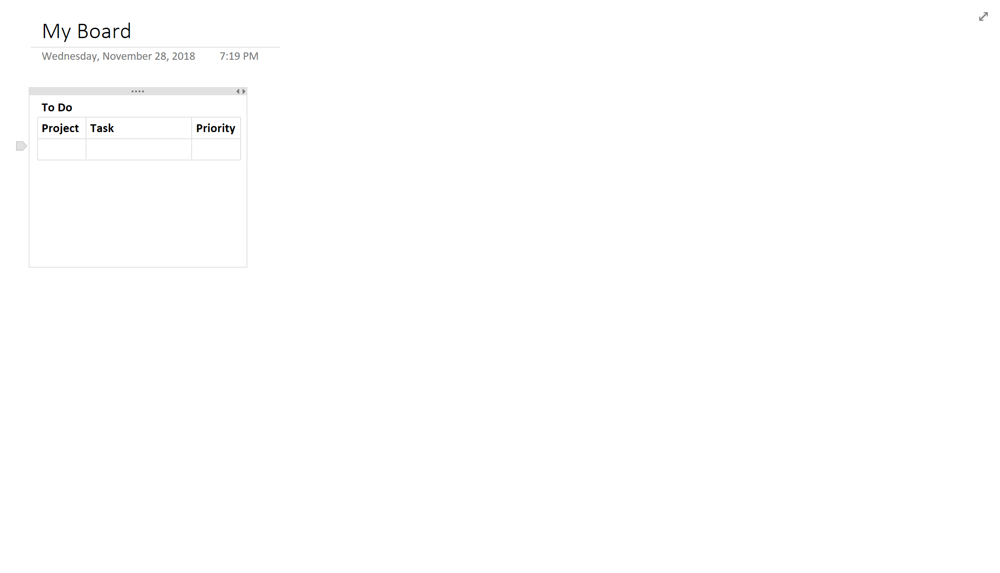
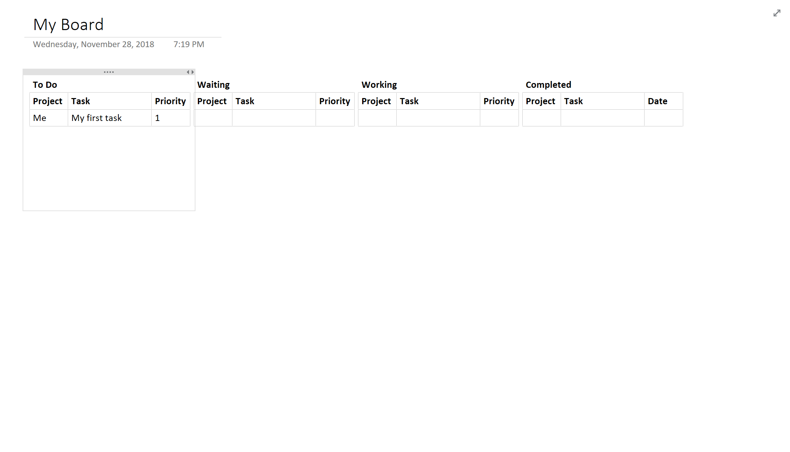

Sometimes, I have trouble prioritizing my tasks. My day becomes a whirlwind of distraction; I end up talking to a lot of different people working on very different projects. This would lead to considerable stress; as soon as I'd start to work on one thing, I'd get pulled away and forget where I left off, or even what I was working on!

I needed a system to keep my head on straight. I played with [Kanban Flow](https://kanbanflow.com/) at home and found it to be incredibly useful, but to my dismay, it wasn't available at work, so I had to find another option.

I turned to OneNote, Microsoft's notetaking software. As I tweaked my little wannabe Kanban Board, I was more and more impressed at the flexibility and utility of OneNote.

<!--truncate-->

## Why Should I?

If you're busy right now, don't let me slow you down - you can stop reading now and go back to what you were doing before I distracted you. This *does* take about five minutes to set up, after all.

On the other hand, you may find that these few short minutes of self-study were a worthy investment when you start to power through work that you were once too frazzled to concentrate on. Kanban is a powerful system, and even if it's heavily modified, this OneNote version could change the way you work for the better.

If you're having trouble prioritizing, this method is for you. The act of prioritizing is basically built in to the system - each table row has little handles that allow you to drag tasks up, down, and between tables as you see fit.

You'll see what I mean.

## Creating the Board

Let's get started. We will be creating four tables to hold tasks: Backlog, Waiting, Working, and Completed. The first thing we need is a table. Think of the table as a cookie cutter for all of your tasks. Each task you keep track of will be molded to the table's design; it serves as the template for everything that moves from the Backlog to Completed. Design it  in a way that makes sense for you. In my case, I like to use three columns: Project, Task, and Priority.

Open a new page and start typing the first column name. Press tab, and it should turn into a table. Type the next one, tab over, and repeat until you have all of the columns. Then, press enter.

<figcaption>Step 1: Create the table taht will serve as a template for others.</figcaption>

Our first table has been set up. The next step is to copy it to make the other tables. Click and drag to highlight the entire table. Next, press `Control-C`, click somewhere else on the page, and hit `Control-V` to duplicate the table and place it somewhere else. Repeat until we have all four tables.

Align your new columns horizontally and name them.

<figcaption>Step 2: Copy the table a few times to make more than one column.</figcaption>

It looks like we're all set up. Now we can put it to good use.

## Using the Board

Create your first task. Click in your Backlog board, fill out each column, and press tab to create a blank row after it. It's a good idea to leave a blank row in there, so that you always have a place to start filling out a new task.

<figcaption>Step 3: Add your first task.</figcaption>

Now let's take a second to imagine this task getting done. We see it on our board and think it's pretty important. So, we start working it. To do this, we hover our mouse just to the left of the row to reveal a little anchor, which we can use to click and drag the row between tables.

The task moves from Backlog to Working, where we spend some time getting it done. Then, we find ourselves waiting for another team member (we'll call him John) to complete work on it before we continue, so we move it to Waiting. Come on, John - check your email already!

With great patience, we wait for John to finish his part and are finally able to complete our task.

<figcaption>Step 4: Move your task across columns as you work it.</figcaption>

## Variations on this Method

As with anything productivity related, you have to figure out what works for you. For example, an easy modification may be removing the "Working" board. Why? Well, you're only one person, so you can only get one thing done at a time! What's the point of a list with one item anyway? Just move it to the top of your Backlog and get to work.

Instead of "Waiting" and "Working", you could just have a "This Week" list. I did this for a while, and it helped me figure out a few of the more important tasks to concentrate on when my Backlog was particularly long.

Finally, make good use of your Completed list. Save those beautiful checked boxes up for a month, and then compile them into some notes. Store these away for your resume, or send them to your boss to remind him or her that you're getting stuff done!

## Go To Town

There you have it. You're equipped with all the tools you need to organize yourself and use Kanban within the comfort of your very own OneNote.

While this method may not be for everyone, it can be the anchor you need if your days have become too hectic. I've recently moved away from this technique, but it kept my head above water at work for a long time. I hope it can do the same for you.
