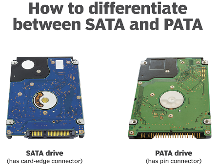

[También disponible en español](./es)

import BlogYoutubeVideo from '~/components/common/BlogYoutubeVideo.astro';

<BlogYoutubeVideo videoId="vNMJbqNZrHI" />

Our entire world runs on computers, but few understand how they work at the lowest level. Everything, from your phone and laptop to the flight controllers on an airliner, has at least one computer chip in it called the CPU, which tells it what to do.

The operating system is supposed to handle all of the low-level operations, including interfacing with hardware. But what does that interface actually look like? It's easy enough to write a file using `file.write()` in Python, but this is just an abstraction for what's really happening. Somewhere, under the covers of layers and layers of abstraction, there's a metal disk spinning, or an solid state drive, and you're rearranging zeros and ones on that drive.

In this series, we throw away all of those comfortable abstractions that are provided to us and do bare-metal programming. Our code runs directly on the processor - there's no standard library, there are no system calls, there's no API other than the processor itself. If figuring out how to make things happen with **only** the processor and nothing else sounds exciting to you, then this series is for you.

PKOS stands for PageKey Operating System, which is an operating system built from scratch, on video, with each lesson learned along the way explained so that you can easily understand it and apply it to your own projects.

In this lesson, we continue our exploration of PCI, clean up the codebase a bit, attempt (unsuccessfully) to use Rust, and begin researching how to write a storage device driver.

## What We Did

Here's a quick summary of what was accomplished since the last video. The most important additions will be expanded upon in the Deep Dives section below.

- Significantly refined `pci.c`
	- Added `struct PCI_Device`
- Code improvements
	- Easier int-to-string calls
	- Screen wrap
- Rust sidequest: unsuccessful
- Researched IDE drivers
- Researched SATA drivers
- Attached SATA device to QEMU

## Lessons Learned

Working through the code for this video yielded a ton of great lessons. Here's what I found:

### Structs are wonderful
I was dragging my feet on implementing a struct to hold the PCI device data I was grabbing from the configuration memory, but I was amazed at how easy it was to do and how much cleaner the code got when I did. Just look at this lovely little struct:

```c
struct PCI_Device {
    u16 vendor_id;
    u16 device_id;
    u8 base_class;
    u8 sub_class;
    u8 prog_interface;
    u16 command;
    u16 status;
};
```

With this in place, I was able to abstract away all of the bitshifting that was required to get this data from the PCI configuration memory and just return the finished object. This made the implementation of `lspci()` much cleaner and easier to read, and it will avoid duplicating code when we write the storage device driver.

### PCI Class and Subclass: Identify device function
Every PCI device has a Vendor ID and a Device ID, and you can use these two numbers to look up exactly what that device is - just type it in on [pcilookup.com](https://www.pcilookup.com/) and see what you come up with!

### Rust bare-metal i686 support is dodgy
I was sad to find that 32-bit x86, also known is i386 or i686, does not have the best support in Rust for bare-metal programming. There is no default `i686-unknown-none` toolchain, which means that you have to define your own based off of the `i686-unknown-linux-gnu`. I tried my best, but couldn't seem to get a multiboot kernel to compile.

I'd love to use Rust if I could figure it out, but it wasn't in the cards for this episode - we'll stick to the simplicity of C for now.

### Storage Drivers: IDE (PATA) and AHCI (SATA) are very different
I spent a fair amount of time trying to get the IDE controller that was attached to QEMU by default working. I'm not sure if it's actually what I need - it seemed to be a cdrom drive.

From what I gathered, IDE/PATA is no longer used for hard drives, but may still be used for CDs. SATA/AHCI, on the other hand, are still very much relevant. See the deep dives below for more information on these technologies.

## Deep Dives

Let's dive into the details of the code for this episode.

### Parsing PCI Fields into Struct
The PCI configuration memory layout was essential in figuring out how to parse the fields:


Recall that we have a working `read_pci_port` function at our disposal, and it takes four single-byte arguments: `bus`, `slot`, `function`, and `offset`. For a given PCI device, we can make multiple calls to this function, changing the `offset` field to grab the variables we want out of the structure above. For example, here's a snippet of how we get the vendor and device ID:

```c
struct PCI_Device device;
u32 pci_data = read_pci_port(bus, slot, function, 0);
device.vendor_id = pci_data & 0xffff;
device.device_id = (pci_data >> 16) & 0xffff;
```

As you can see, we grab 32-bits at offset 0, then bitshift/AND the result until we isolate the fields that we need.

Check out this early look at the lspci method:


It looks great! The only problem is that there are quite a few devices with Vendor ID "pppp." That can't be right - so what's going on here? Well...

### Ignoring Non-Existent PCI Devices

The Linux kernel finds non-existent PCI devices by checking if the PCI class field is set to `0xFFFFFFFF` [^1]. OSDev mentions that you can also check whether the Vendor ID field is set to `0xFFFF` [^2]. Though both probably work, I went with the latter technique. Applying this knowledge will save our `lspci()` function some work by skipping any further processing when it detects a nonexistent device:

```c
struct PCI_Device device = get_pci_device(i, j, k);
if (device.vendor_id == 0xFFFF) {
	continue;
}
```

Now we only see a few devices, and none of them have invalid fields for Vendor ID anymore!


### Looking Up PCI Devices
Looking at the above screenshot, how much can you tell about the devices listed? At first, I had no clue where to start with deciphering these fields. However, a quick search showed me that I can use [pcilookup.com](https://www.pcilookup.com/) to find out what each of these devices are. For example, looking up Vendor ID 8086 and Device 7010 yields:


This matches up with the QEMU documentation, and with the output of `info qtree`, so it seems like our `lspci()` method is accurate.

### PCI Base Class, Subclass, and Programming Interface

The PCI fields list above shows one big 3-byte chunk for "Class Code," but documentation sometimes referred to the "subclass" field, which I couldn't seem to find anywhere. However, it did seem to be a powerful way to tell what type of device you were dealing with - as an example, class 1 indicates a mass storage device, and class 1 subclass 1 indicates an IDE interface [^3].

The specification documents for PCI don't seem to be freely available online - you have to login to PCI-SIG's website to download any of them. However, someone hosted the "PCI Local Bus Specification" from 2004 on their website [^4], so I was able to take a look. On page 217, we see:

> The Class Code register is read-only and is used to identify the generic function of the device and, in some cases, a specific registerlevel programming interface. The register is broken into three bytesize fields. The upper byte (at offset 0Bh) is a base class code which broadly classifies the type of function the device performs. The middle byte (at offset 0Ah) is a sub-class code which identifies more specifically the function of the device. The lower byte (at offset 09h) identifies a specific register-level programming interface (if any) so that device independent software can interact with the device. Encodings for base class, sub-class, and programming interface are provided in Appendix D. All unspecified encodings are reserved.

So, this just means that the three bytes allocated for "Class Code" are one byte each, representing base class at `0x0b`, subclass at `0x0a`, and programming interface at `0x09`. Simple enough! We can parse those fields with this snippet:

```c
pci_data = read_pci_port(bus, slot, function, 0x09);
device.base_class = (pci_data >> 16) & 0xff;
device.sub_class = (pci_data >> 8) & 0xff;
device.prog_interface = pci_data & 0xff;
```

I cheated a little bit by reading with offset `0x09` to save some bitshifting. I'm not sure if there is some kind of performance impact for not reading at 4-byte boundaries. There probably is, but for our purposes, does it really matter?

### Attempts to use Rust
I attempted to create a multiboot i386 kernel using Rust. If I had been successful, I could have linked in all of the existing C and assembly code into that executable, and any new development could have been in Rust! Unfortunately, I hit some roadblocks.

A StackOverflow answer by phip1611 [^5] informed me that while there's no built-in target for bare-metal 32-bit x86 code, you can define a custom target by putting a JSON file at the root of the project and pointing to it in `.cargo/config.toml`. Using the `#![no_std]` and `#![no_main]` macros turn off the standard library and main method, which enable bare-metal execution.

I also found an awesome tutorial called "Writing an OS in Rust" [^6] which explained each piece of the puzzle very clearly. However, the whole tutorial was written for x86_64. Maybe the time to upgrade PKOS is coming, but I'm not ready to let go of 32-bit yet.

After messing with `xargo` for cross compiling for quite a while, I finally gave up on this path - for now.

### What is IDE?

IDE stands for Integrated Drive Electronics. It's an electrical standard for disk storage devices released in 1990. It was originally referred to as Advanced Technology Attachment (ATA), but after the introduction of Serial ATA (SATA), it was renamed to Parallel ATA (PATA) [^7].

We can identify IDE devices using the Class Code field in the PCI configuration space. OSDev wiki [^8] tells us:

> If the class code is 0x01 (Mass Storage Controller) and the subclass code is 0x01 (IDE), the device is an IDE controller.

This takes care of the first two fields, but what about that pesky Programming Interface byte? I found something that says it's used to indicate whether the primary and secondary storage devices are programmable, as well as their operating mode [^9].


*Photo Credits: [^9]*

I was able to find the specification for a PCI IDE card online, and I particularly enjoyed seeing that the class codes matched up with what I had seen so far from other sources:


*Photo Credits: [^11]*

Another potentially helpful resource was a guide for writing an IDE driver from the RTEMS real time operating system's documentation [^12]. I was also able to find the source code on GitHub [^13]. It seems like the ATA driver in `ata.c` uses the (perhaps) lower-level functions in `ide_controller.c`, but I'm not quite sure.

RTEMS provides a separate guide for writing an ATA driver [^16]. OSDev has one too [^17]. This is confusing, because the TechTarget article [^7] seems to indicate that ATA and IDE are basically interchangeable.

### What is SATA?

SATA stands for Serial Advanced Technology Attachment, defined, as noted above, in contrast to IDE/PATA. AHCI stands for Advanced Host Controller Interface. I've seen these two acronyms used interchangeably in some of the drivers I saw online. However, Dell indicates that it may be more complicated to support an AHCI device than a SATA device [^11]. 


*Photo credits: TechTarget [^7]*

### Adding SATA to QEMU

A Stack Overflow answer by mwfearnley [^14] notes how to explicitly add a SATA device to QEMU:

```
-drive id=disk,file=IMAGE.img,if=none \
-device ahci,id=ahci \
-device ide-hd,drive=disk,bus=ahci.0
```

I appended these lines to the `os.py` script's `run` and `run_debug` methods and, lo and behold, the SATA drive appeared in `lspci`! It's on Bus 0, Device 4, Function 0 in the image below:


Ruben Schade highlighted a similar technique for adding the drive in his blog [^15]. It also seems like it may have been enough to simply add `-hda IMAGE.img` to the QEMU run command, but since I did it the complicated way first and it worked, I just stuck with it. 

## Wrap-Up

Even though I didn't quite get as far as I'd hoped in this episode, I still made some progress and learned a lot. I hope you enjoyed it and learned something too!

Next steps for this project will likely be trying to get some sort of SATA driver working, though from what I've seen so far, I'm a little intimidated by how complex it can get. We'll see where things go!

If you enjoyed this post, consider subscribing to the [PageKey YouTube channel](https://youtube.com/@PageKey).

Additional source: [^10]

[^1]: Linux kernel "early_dump_pci_devices" method checking whether the device exists using the class field. https://git.kernel.org/pub/scm/linux/kernel/git/stable/linux.git/tree/arch/x86/pci/early.c?id=refs/tags/v3.12.7#n96
[^2]: OSDev PCI page. https://wiki.osdev.org/PCI
[^3]: Site showing the PCI device classes and subclasses. https://pci-ids.ucw.cz/read/PD/
[^4]: PCI Local Bus Specification from 2004. https://lekensteyn.nl/files/docs/PCI_SPEV_V3_0.pdf
[^5]: Bare-metal x86 Rust target, thanks phip1611. https://stackoverflow.com/questions/67902309/how-to-compile-rust-code-to-bare-metal-32-bit-x86-i686-code-what-compile-targ
[^6]: Writing an OS in Rust: https://os.phil-opp.com/freestanding-rust-binary/
[^7]: TechTarget high level description of PATA and SATA interfaces. https://www.techtarget.com/searchstorage/definition/IDE
[^8]: OSDev PCI IDE Controller article. https://wiki.osdev.org/PCI_IDE_Controller
[^9]: PCI IDE Controller Specification. http://www.isdaman.com/alsos/hardware/hdc/pciide.pdf
[^10]: Example of a PCI IDE controller card vendor specification. https://pdf.dzsc.com/PC8/PC87410.pdf
[^11]: Dell article on SATA vs AHCI. https://www.dell.com/support/kbdoc/en-us/000127508/difference-between-ahci-and-sata
[^12]: RTEMS guide for PCI IDE drivers. https://docs.rtems.org/branches/master/bsp-howto/ide_controller.html
[^13]: RTEMS PCI IDE driver reference implementation. https://github.com/RTEMS/rtems/tree/master/bsps/shared/dev/ide
[^14]: Stack Overflow on adding a SATA drive to QEMU. https://stackoverflow.com/questions/48351096/how-to-emulate-a-sata-disk-drive-in-qemu
[^15]: Ruben Schade on adding a SATA drive to QEMU. https://rubenerd.com/sata-on-qemu/
[^16]: RTEMS ATA driver guide. https://docs.rtems.org/branches/master/bsp-howto/ata.html
[^17]: OSDev ATA driver. https://github.com/levex/osdev/blob/master/drivers/ata.c
