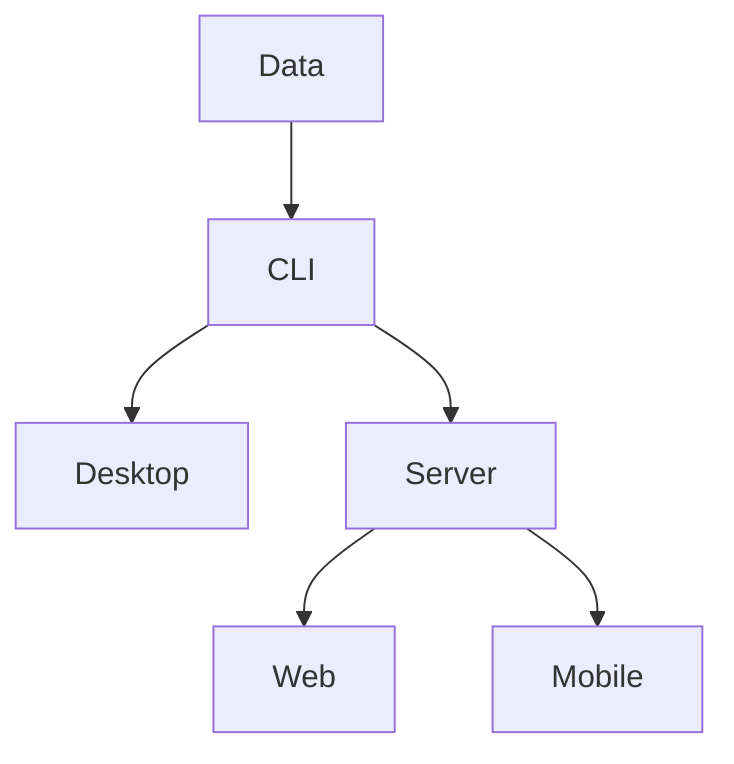
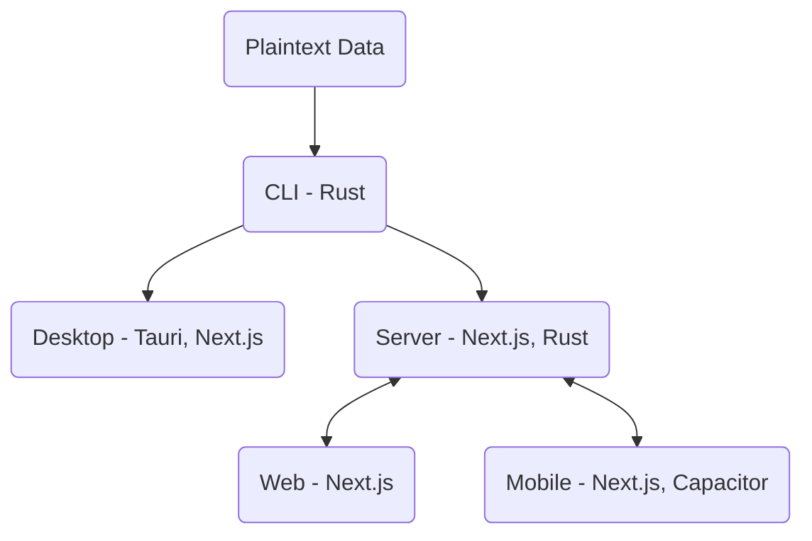

Why aren't more applications powered by plaintext (human-readable) data? It brings so many benefits - you can store/sync the data using your filesystem, inspect the data yourself, and even write apps and scripts to process it and mine for insights.

I think we need more software to be written this way. For too long, the pendulum has swung in the direction of SaaS - other people's code running on other people's computers. We may be on the verge of inverting this. Think about it. Do you really need to connect to some distant data center to use Intuit Quickbooks for your accounting? Not if you use something like [hledger](https://hledger.org/), which serves a similar purpose, but it's completely open-source and runs locally.

I'm fascinated by the idea of making programming **simple** and **declarative** enough that the average person can specify how all of their day-to-day applications should behave. We've certainly taken a big step in that direction with LLMs, but unless you self-host that, you're still tied to someone's ChatGPT web service running in the cloud.

In this article, I'll take a step in the right direction by proposing an architecture that will allow plaintext-based applications to run on every relevant platform. Actually, it may start out as more of a process that can eventually be turned into a resuable framework.

There is no shortage of fantastic tools that already exist to help with this. The challenge is integrating them together in a way that provides a great experience, both for the user and for the developer (who are, increasingly, the same person!).

I envision a future where all of the applications we use are backed by plaintext, enabling people to explore their own data and write their own extensions and tools to tailor the experience to exactly what they need. To get there, we need to rethink the classic client-server architecture that's so common.

import BlogYoutubeVideo from '~/components/common/BlogYoutubeVideo.astro';

<BlogYoutubeVideo videoId="iM8XZOPYktM" />

## Where We Are Now

As I mentioned, the software most people is use in "the Cloud." Think about Gmail, Salesforce, ChatGPT, and DuoLingo. All of these require you to log into some faraway server (that you don't own) to use their service. You have no access to the data behind the scenes - you're forced to use *their* UI, *their* way. If you're lucky, you'll have access to some sort of API to automate things, but this is usually complicated and out of reach for anyone who's not already a software developer.

You could certainly use something like [Selenium](/blog/2020/90-sec/selenium-ubuntu) to automate browser behavior - [I've done this with DuoLingo before](/blog/2020/duobot) - but this is even harder than using an API!

Apps like FL Studio or Adobe Premiere (see [Shotcut](https://shotcut.org/) for an open-source alternative) are better because they run locally. However, they still store their data in proprietary blobs that are impossible for humans to read and useless to any program but their own.

I think we can do better! But how?

## Proposed Architecture

Start with the plaintext files, the **data**, at the absolute center, rather than a server/web app codebase. Work out from there - first, create a CLI to easily manage those files locally. Then, whip up a graphical user interface that can run locally. Next, create a server to provide the same functionality to remote clients that can't really manage their own files (for example, it's REALLY tough to install Git or Python on an iPhone).

Finally, implement the web and mobile clients to interact with that server, sharing as much of your local frontend code as possible. The result? You have one codebase that can basically run on everything and replicate the same functionality everywhere.

In particular, I'd propose this tech stack:

Another key piece of this could be [syncthing](https://syncthing.net/), which can be hosted on the same machine as the server code. This has two benefits:

1. You can instantly, easily sync the files on your server to your laptop and back. Backing up becomes as easy as tarring and pushing to a cloud provider.

2. It separates the act of syncing and backing up your files from the (unrelated) application producing those files.

### Data First

Let the data format drive all of the code. If you're making an accounting app, come up with some sample data in a YAML file and then write code to parse it. After that, write an interface to **create** data in that format by prompting the user.

### CLI Second

After creating some sample data, the CLI should be the next step. It's by far the easiest way to interact with the user. You don't have to worry about how things are presented - if they know how to use a terminal, they'll be able to figure it out.

I think pure Rust is a great choice for this, because it's a blazing-fast systems language that has great web support and built-in package management.

### Desktop Client

Adding a desktop client after the CLI allows you to formalize your user interface and add some bells and whistles while keeping the feedback loop short. No need to fiddle with any networking yet, just mature your code and provide an interface that you don't need to be a CLI ninja to understand.

You can use [Tauri](https://tauri.app/) to quickly and easily add a frontend to a Rust application. You can use vanilla JS or your favorite framework, such as [Next.js](https://nextjs.org/). The key will be finding a way to share the Tauri/Next code with the server and web/mobile clients.

### Server

At that point, the main functionality of your code (file operations) should be abstracted away. They're used in two places - the CLI and the GUI - so it should be easy to add a third. We need to create a REST API for these file operations and so that we can make changes remotely!

I'm not sure exactly how this would look yet - would you run the Next.js application and use its API routes for convenient access, or is there a way to expose a quick REST API directly in Rust?

Rust seems to have great web support, so I'd expect that with some careful modular coding, it would be possible to get this all working together. Perhaps something like [Actix](https://actix.rs/) would be worth using.

Either way, our codebase stays mostly the same - when running in server mode, you're just accepting HTTP requests to perform operations instead of Tauri or CLI commands. Authentication may come into play here eventually, but for now let's keep it simple.

### Web/Mobile Clients

Generating a web client should be as easy as running `npm run export` in your Next.js project to get a static website. There may need to be some careful `if/else` guards in place to avoid baking Tauri commands into the static export (instead, it should use the REST endpoint).

Mobile can be generated using [Capacitor](https://capacitorjs.com/) and should be identical to the web client, save for a few platform-specific tweaks.

## Hosting: Keep it simple

Kubernetes is pretty complicated. The whole point of this architecture is to make things more accessible for the average user. It may make sense to provide some easy `docker-compose` tips and tricks as part of this framework, if it ever comes together. This way, anyone setting this up just needs to run `docker-compose up` and their server is off and running.

## Next Steps

Let's do this. I want to write an application to manage my to-do's, and I'm going to name it KeyDo. I'll try to implement this architecture in KeyDo, possibly stealing some Tauri code from [Plaintext DAW](/products/ptd) along the way.
