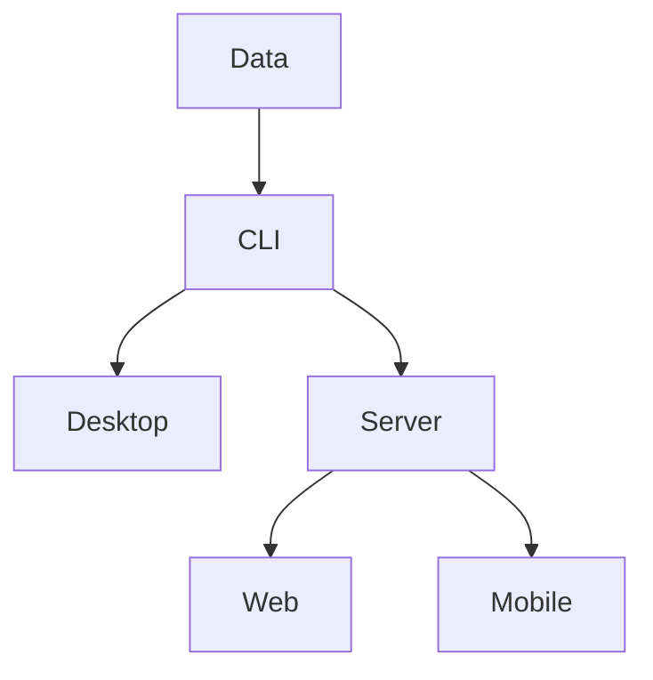
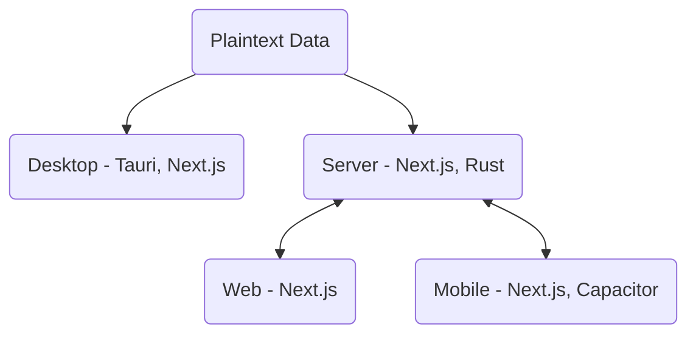

Why aren't more applications powered by plaintext (human-readable) data? It brings so many benefits - you can store/sync the data using your filesystem, inspect the data and even apps andscripts to process it and mine for insights.

I think we need more software to be written this way. For too long, the pendulum has swung in the direction of SaaS - other people's code running on other people's computer. I think we're on the verge of inverting this. Think about it. Do you really need to connect to some distant data center to use Intuit Quickbooks for your accounting? Not if you use something like [hledger](https://hledger.org/), which serves a similar purpose, but it's completely open-source and runs locally.

I'm fascinated by making programming simple and declarative enough that the average person can specify how all of the apps they use work. We've certainly taken a big step in that direction with LLMs, but unless you self-host that, you're still tied to someone's ChatGPT web service running in the cloud.

In this article, I'll take a step in the right direction by proposing an architecture that will allow plaintext-based applications to run on every relevant platform. Actually, it may start out as more of a process that can eventually be turned into a resuable framework.

There are no shortage of fantastic tools that already exist to help with this. The challenge is integrating them together in a way that provides a great experience, both for the user and for the developer (who are, increasingly, the same person!).

I envision a future where all of the applications we use are backed by plaintext, enabling people to explore their own data and write their own extensions and tools to tailor the experience to exactly what they need. To get there, we need to rethink the classic client-server architecture that's so common.

## Where We Are Now

As I mentioned, the software most people is use in "the Cloud." Think about Gmail, Salesforce, ChatGPT, and DuoLingo. All of these require you to log into some faraway server (that you don't own) to use their service. You have no access to the data behind the scenes - you're forced to use *their* UI, *their* way. If you're lucky, you'll have access to some sort of API to automate things, but this is usually complicated and out of reach for anyone who's not already a software developer.

You could certainly use something like [Selenium](../2020/90-sec/selenium-ubuntu) to automate browser behavior - [I've done this with DuoLingo before](../2020/duobot) - but this is even harder than using an API!

Apps like FL Studio or Adobe Premeire (see [Shotcut](https://shotcut.org/) for an open-source alternative) are better because they run locally. However, they still store their data in proprietary blobs that are impossible for humans to read and useless to any program but their own.

I think we can do better! But how?

## Proposed Architecture

Start with the files at the absolute center, rather than a server codebase. Work out from there - first, a client to easily manage those files locally. Then, a server to provide the same functionality to remote clients that can't really manage their own files (for example, REALLY tough to install Git or Python on an iPhone). Finally, the web and mobile clients to interact with that server. Result: You have one codebase that can basically run on everything and replicate the same functionality everywhere.

In particular, I'd propose this tech stack:

## Data First

Write sample file, parse it, do something.

## CLI Second

Design the CLI first, then auto-generate a UI from it, etc.

## Desktop Client

The first thing to develop for one of these applications is the desktop client. This is where you can most easily iterate on how to files are managed and what the user interface looks like. What could be simpler than displaying some windows, clicking some buttons, and wiring up handlers to make changes on the filesystem?

For this piece, I'll use Tauri as the main framework. This is a Rust framework that lets you write your UI in any JavaScript framework. For the JS side, I'll use Next.js, only because I'm most familiar with it and it comes "batteries included" with most of the libraries you'd need to make something cool.

In addition to directly modifying the filesystem, you can also easily run shell commands. This allows you to use something like Git to manage, version, and back up the plaintext files. I think a similar paradigm to what Obsidian uses would be helpful here, where you can open a different "vault" to change the context of what you're working on. In this case, each vault can be a separate Git repo.

## Server

Now let's zoom out a bit. Instead of everything being local, we can write a server with a REST API. This API will perform the same actions that the local client did on files, but it allows you to have web/mobile clients invoke these operations.

For this, I'd keep the setup as similar as possible. I'm not sure exactly how this would look - would you run the Next.js application and use its API routes for convenient access, or is there a way to expose a quick REST API directly in Rust?

Rust seems to have great web support, so I'd expect that with some careful modular coding, it would be possible to get this all working together. Perhaps something like [Actix](https://actix.rs/) would be worth using.

Either way, our codebase stays mostly the same - when running in server mode, you're just accepting HTTP requests to perform operations instead of Tauri commands. Authentication may come into play here eventually, but for now let's keep it simple.

## Web/Mobile Clients

TODO
Next.js static export. Capacitor for mobile. Enter URL of server to get started. Maybe authenticate.
## Hosting: Keep it simple (Some ideas)

TODO
Kubernetes is pretty complicated. The whole point of this architecture is to make things more accessible for the average user. 
docker compose. Kubernetes is great for massive scale, but too complicated and easy to break for the average self-hoster (with probably a max of 10 users anyway)

## Next Steps

TODO
Let's do this. I'm going to try to implement this architecture in KeyDo. I'll be stealing some code from Plaintext DAW to get that done, but I'll have to carefully set everything up to reflect the above and share code so that nothing is repeated.

## Scaling: Federation

TODO
No idea on this. Need to research how to share data across instances to provide social features without centralized server.
