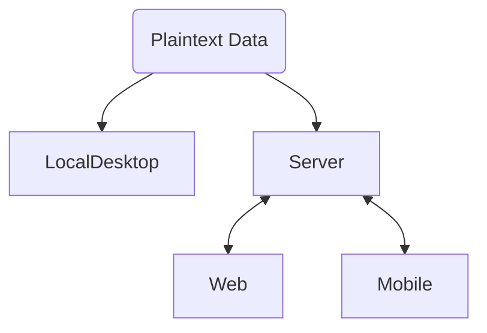
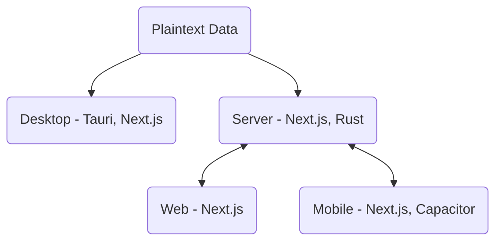

## Intro
I'm fascinated by the ability to do things in "plaintext," which is just what it sounds like - all of your data for an application you're using is stored in regular old text files that anyone can open and read. More importantly, anyone can analyze, transform, and manage these files using common tools such as Python scripts and Git repos. I envision a future where all of the applications we use are backed by plaintext, enabling people to explore their own data and write their own extensions and tools to tailor the experience to exactly what they need.
To get there, we need to rethink the classic client-server architecture that's so common.
## Where We're At Now
Client-server OR Desktop with binary backend / some other inconvenient format
Examples: client-server (SaaS) = gmail, salesforce, chatgpt, duolingo. Desktop = FL Studio
## Proposed Architecture
Start with the files at the absolute center, rather than a server codebase. Work out from there - first, a client to easily manage those files locally. Then, a server to provide the same functionality to remote clients that can't really manage their own files (for example, REALLY tough to install Git or Python on an iPhone). Finally, the web and mobile clients to interact with that server. Result: You have one codebase that can basically run on everything and replicate the same functionality everywhere.

In particular, I'd propose this tech stack:

## Desktop Client
Tauri, Next.js. Direct interaction with plaintext files / git
## Server
Next.js, Rust. Same rust direct file interactions, just exposed to server instead of directly accessed through Tauri commands. Server invokes system call?
## Web/Mobile Clients
Next.js static export. Capacitor for mobile. Enter URL of server to get started. Maybe authenticate.
## Hosting: Keep it simple
Kubernetes is pretty complicated. The whole point of this architecture is to make things more accessible for the average user. 
docker compose. Kubernetes is great for massive scale, but too complicated and easy to break for the average self-hoster (with probably a max of 10 users anyway)
## Scaling: Federation
No idea on this. Need to research how to share data across instances to provide social features without centralized server.

## Next Steps
Let's do this. I'm going to try to implement this architecture in KeyDo. I'll be stealing some code from Plaintext DAW to get that done, but I'll have to carefully set everything up to reflect the above and share code so that nothing is repeated.
