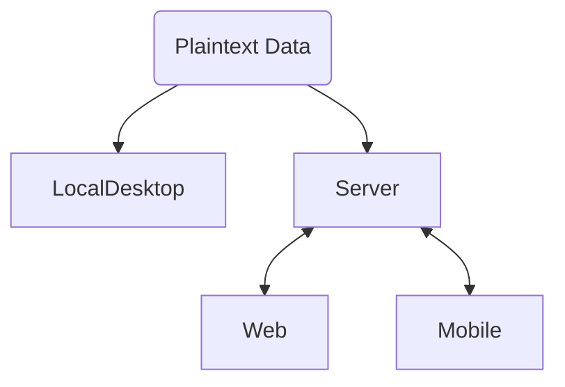
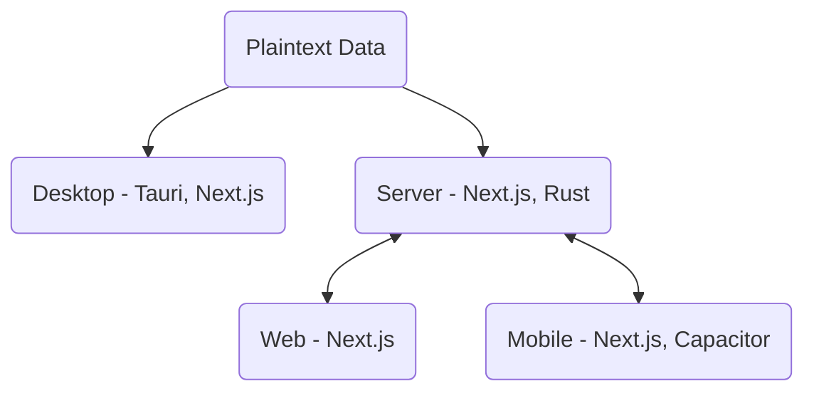

## Intro

Why aren't more applications powered by "plaintext" data? It brings so many benefits - you can manage data storage and sync using your filesystem, you can inspect the data and write any number of third party apps/scripts to process it however you'd like, and generally there's just so much more transparency.

I think we need more software to be written this way. I've been fascinated by the idea of writing all of the software I use myself. Someday, I'd like to make this something simple, that anyone can do. But my initial forays into this world have shown it to be extremely complicated.

In this article, I'll take a step in the right direction by proposing an architecture - or maybe more of a process to start - that will allow people to create plaintext applications that run on every platform. I think there are fantastic tools that already exist to help with this. The challenge is integrating them together in a way that provides a great experience, both for the user and for the developer (who are, increasingly, the same person!).

??

I'm fascinated by the ability to do things in "plaintext," which is just what it sounds like - all of your data for an application you're using is stored in regular old text files that anyone can open and read. More importantly, anyone can analyze, transform, and manage these files using common tools such as Python scripts and Git repos. I envision a future where all of the applications we use are backed by plaintext, enabling people to explore their own data and write their own extensions and tools to tailor the experience to exactly what they need.
To get there, we need to rethink the classic client-server architecture that's so common.

## Where We Are Now

TODO
Client-server OR Desktop with binary backend / some other inconvenient format
Examples: client-server (SaaS) = gmail, salesforce, chatgpt, duolingo. Desktop = FL Studio

## Proposed Architecture

Start with the files at the absolute center, rather than a server codebase. Work out from there - first, a client to easily manage those files locally. Then, a server to provide the same functionality to remote clients that can't really manage their own files (for example, REALLY tough to install Git or Python on an iPhone). Finally, the web and mobile clients to interact with that server. Result: You have one codebase that can basically run on everything and replicate the same functionality everywhere.

In particular, I'd propose this tech stack:

## CLI First

Design the CLI first, then auto-generate a UI from it, etc.

## Desktop Client

The first thing to develop for one of these applications is the desktop client. This is where you can most easily iterate on how to files are managed and what the user interface looks like. What could be simpler than displaying some windows, clicking some buttons, and wiring up handlers to make changes on the filesystem?

For this piece, I'll use Tauri as the main framework. This is a Rust framework that lets you write your UI in any JavaScript framework. For the JS side, I'll use Next.js, only because I'm most familiar with it and it comes "batteries included" with most of the libraries you'd need to make something cool.

In addition to directly modifying the filesystem, you can also easily run shell commands. This allows you to use something like Git to manage, version, and back up the plaintext files. I think a similar paradigm to what Obsidian uses would be helpful here, where you can open a different "vault" to change the context of what you're working on. In this case, each vault can be a separate Git repo.

## Server

Now let's zoom out a bit. Instead of everything being local, we can write a server with a REST API. This API will perform the same actions that the local client did on files, but it allows you to have web/mobile clients invoke these operations.

For this, I'd keep the setup as similar as possible. I'm not sure exactly how this would look - would you run the Next.js application and use its API routes for convenient access, or is there a way to expose a quick REST API directly in Rust?

Rust seems to have great web support, so I'd expect that with some careful modular coding, it would be possible to get this all working together. Perhaps something like [Actix](https://actix.rs/) would be worth using.

Either way, our codebase stays mostly the same - when running in server mode, you're just accepting HTTP requests to perform operations instead of Tauri commands. Authentication may come into play here eventually, but for now let's keep it simple.

## Web/Mobile Clients

TODO
Next.js static export. Capacitor for mobile. Enter URL of server to get started. Maybe authenticate.
## Hosting: Keep it simple

TODO
Kubernetes is pretty complicated. The whole point of this architecture is to make things more accessible for the average user. 
docker compose. Kubernetes is great for massive scale, but too complicated and easy to break for the average self-hoster (with probably a max of 10 users anyway)
## Scaling: Federation

TODO
No idea on this. Need to research how to share data across instances to provide social features without centralized server.

## Next Steps

TODO
Let's do this. I'm going to try to implement this architecture in KeyDo. I'll be stealing some code from Plaintext DAW to get that done, but I'll have to carefully set everything up to reflect the above and share code so that nothing is repeated.
